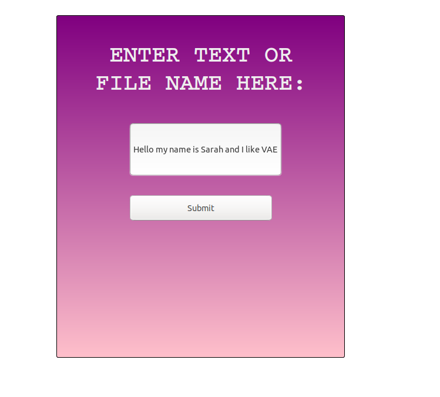
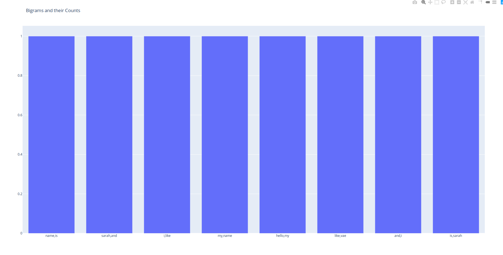

# Bigrams Application 

## Sarah Polzer

Takes in string or a file name on a web application and returns a bar chart of the Bigrams in the text. Runs on Python 3.

### Dependencies

This build requires Python 3. If you don't have Python installed, installation instructions are located here:

https://realpython.com/installing-python/

Flask==1.1.1

nltk==3.4.5

plotly==4.1.1

Dependencies can be installed with pip3. Installation instruction are here: https://pip.pypa.io/en/stable/installing/. I'm using Ubuntu, so I just installed pip3 with apt-get.

```bash
sudo apt-get install python3-pip
```

Once pip3 is installed, dependencies can be installed from the requirements.txt file. The command for installation is below.

```bash
pip3 install -U -r requirements.txt
```

### **Run the Application**

Go into the app folder and run 

```bash
python3 bigrams_app.py
```

A home page should launch at localhost:5000



Click submit and you should see a bar chart of all of the Bigrams and their counts

